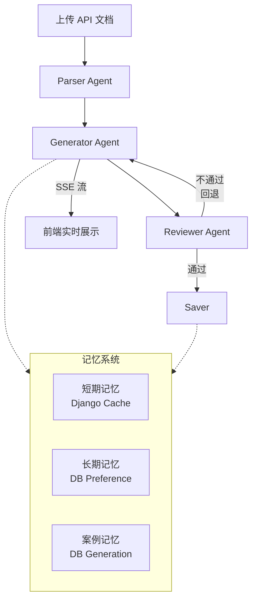
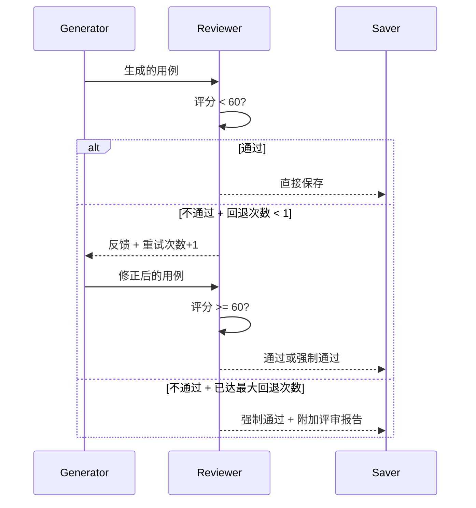
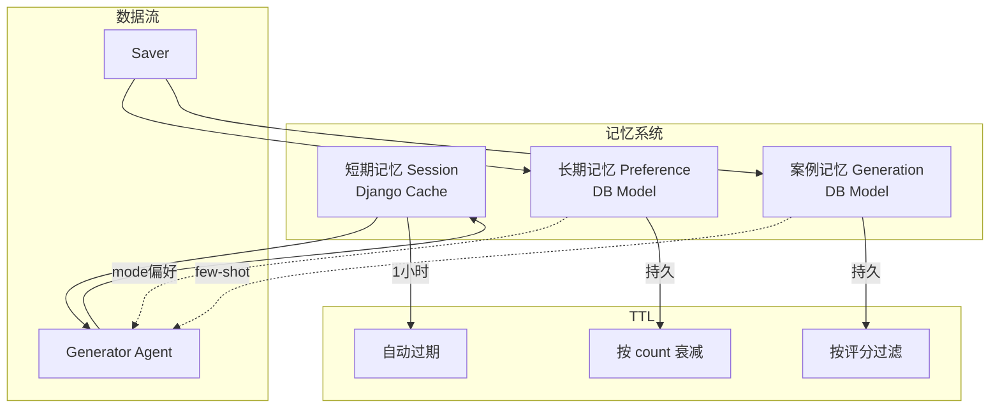

# AI Import 增强型工作流重构优化设计

> **版本**: v1.0  
> **日期**: 2026-07-12  
> **状态**: 设计稿  
> **作者**: AI 架构师

---

## 目录

1. [现状分析](#1-现状分析)
2. [目标架构](#2-目标架构)
3. [Parser Agent 设计](#3-parser-agent-设计)
4. [Generator Agent 重构](#4-generator-agent-重构)
5. [Reviewer Agent（新增）](#5-reviewer-agent新增)
6. [Saver 重构](#6-saver-重构)
7. [记忆系统设计](#7-记忆系统设计)
8. [流式输出（SSE）](#8-流式输出sse)
9. [迁移路线图](#9-迁移路线图)
10. [文件布局与改动清单](#10-文件布局与改动清单)
11. [测试策略](#11-测试策略)
12. [未来展望](#12-未来展望)

---

## 1. 现状分析

### 1.1 当前架构

```
Upload (API doc) → Parse (doc_parser) → LLM (AnalyzeGenerator) → Validate → Save
                          ↑
                    [AnalyzeGenerator]
                    ┌─────────────────────────────────────┐
                    │ 1. _get_task()                      │
                    │ 2. _build_prompt()                  │
                    │ 3. _call_llm()  ← asyncio.run()     │
                    │ 4. _parse_llm_response()            │
                    │ 5. validate_generator_output()      │
                    │ 6. retry loop (max 2)               │
                    └─────────────────────────────────────┘
```

当前代码库的核心逻辑位于 `apps/api_testing/ai_agent/generator.py` 的 `AnalyzeGenerator` 类。它本质上是一个**线性管道** —— 单次 LLM 调用、一段 JSON 解析、一次校验就完成全部产出。

### 1.2 四个核心问题

| # | 问题 | 具体表现 | 影响 |
|---|------|---------|------|
| 1 | **无质量门禁** | LLM 输出什么就是什么，没有独立的评审环节 | 低质量用例直接进入用户界面，用户体验差 |
| 2 | **无流式输出** | `asyncio.run()` 阻塞直到 LLM 返回完整响应 | 20 个端点需要 30-90s 静默等待，用户会以为系统卡死 |
| 3 | **无记忆系统** | 每次分析独立，不学习用户偏好和历史 | 同样的端点每次产生不同的 _mode 分配，用户反复填写 |
| 4 | **_mode 决策依赖 LLM** | prompt 中靠文字指令让 LLM 决定字段是 `user_input` 还是 `ai_generated` | 决策不稳定，时对时错，Token 成本浪费 |

### 1.3 为什么需要重构

```
当前（线性管道）:
  Upload → LLM(1x) → Validate → User Fill → Save
  │                    │           │
  │ 无流式             │ 无评审    │ 每次都一样
  └────────────────────┴───────────┘

目标（增强型工作流）:
  Upload → Parser → Generator → Reviewer → User Fill → Saver
                    │ (流式)     │ (质量门禁) │
                    │            │ (可回退)   │
                    └────────────┴────────────┘
                    ← 记忆系统反馈 (学习历史) →
```

**核心判断**：当前场景不适用纯 ReAct Agent（任务确定性高、输出格式严格），应该用**工作流**，但在 2-3 个节点中引入 AI 增强。

---

## 2. 目标架构

### 2.1 整体架构



### 2.2 四阶段工作流

```
┌──────────────────────────────────────────────────────────────────┐
│                    WorkflowEngine (Orchestrator)                  │
├──────────┬──────────┬──────────┬──────────┬───────────────────────┤
│  Phase 1 │  Phase 2 │ Phase 3 │ Phase 4 │                      │
│  Parser  │ Generator│ Reviewer│  Saver  │    Memory Layer       │
├──────────┼──────────┼──────────┼──────────┼───────────────────────┤
│规则解析  │ LLM 生成 │ 覆盖率  │ DB 写入  │ 短期: Cache          │
│AI 补全   │ 流式输出 │ 断言    │ 记忆同步  │ 长期: DB Preference  │
│复杂度    │ 模式决策 │ 数据    │          │ 案例: DB Generation  │
│评估      │ 重试     │ 合理性  │          │                      │
└──────────┴──────────┴──────────┴──────────┴───────────────────────┘

时间线:
Parser ──→ Generator ──→ Reviewer ──→ User Fill ──→ Saver
  │           │             │              │           │
  │ 规则+AI   │ 流式输出    │ 评分+反馈     │           │
  ▼           ▼             ▼              ▼           ▼
  1-2s      10-60s        2-5s          用户操作     1-2s
```

### 2.3 与当前架构的对比

| 维度 | 当前架构 | 目标架构 |
|------|---------|---------|
| **LLM 调用次数** | 1 次 / 批 | 2-3 次 / 批（生成 + 评审，可选补全） |
| **质量保障** | 仅 JSON Schema 校验 | Schema 校验 + AI 评审（评分制） |
| **用户等待体验** | 30-90s 静默等待 | SSE 流式实时推送进度 |
| **_mode 决策** | LLM 决定（不稳定） | 规则引擎 + 用户偏好覆盖 |
| **学习能力** | 无 | 短期 + 长期 + 案例记忆三层 |
| **回退/重试** | JSON 解析失败重试 | 评审不通过也回退重试 |
| **可审计性** | 只有最终结果 | 每个阶段可追踪、可日志 |

### 2.4 关键设计原则

1. **状态托管于 DB，不依赖内存**：任务状态存入 `AIImportTask.status`，即使进程重启可恢复
2. **LLM 只做其擅长的事**：生成和评审，不做结构化决策（如 _mode 分配）
3. **质量双门禁**：`validate_generator_output()` 硬门禁（格式校验）+ `ReviewerAgent` 软门禁（语义评分）
4. **渐进式迁移**：4 个 Phase，每个 Phase 独立可验证，不阻塞现有功能

---

## 3. Parser Agent 设计

### 3.1 当前状态

当前文档解析由 `doc_parser.py` 完成，纯规则引擎，质量已经很好：
- Swagger 2.0 / OpenAPI 3.0 / Postman / HAR 四种格式检测
- `$ref` 递归解析
- 参数、请求体、响应体、认证方式提取

**不足**：对于缺失字段描述、端点复杂度没有 AI 辅助，后端生成的 JSON 只包含原始数据结构。

### 3.2 增强设计

```python
class ParserAgent:
    """增强版解析器：规则解析 + AI 字段描述补全 + 复杂度评估"""
    
    def __init__(self, task_id: int):
        self.task_id = task_id
        self._task: Optional[AIImportTask] = None
    
    def enhance_endpoints(self, endpoints: List[dict]) -> Tuple[List[EnhancedEndpoint], Dict[str, float]]:
        """
        1. 用规则提取现有字段信息
        2. 批量检测哪些字段缺少描述（仅 body/params 中的关键字段）
        3. 对缺少描述的字段，一次 LLM 调用批量补全
        4. 计算每个端点的复杂度评分
        Returns: (enhanced_endpoints, method+path → complexity_score)
        """
```

#### 3.2.1 EnhancedEndpoint 数据模型

```python
class EnhancedEndpoint(TypedDict, total=False):
    """增强后的端点，比原始 ParsedEndpoint 多 AI 元数据"""
    # 原始字段（保持兼容）
    path: str
    method: str
    summary: str
    description: str
    tags: List[str]
    parameters: List[ParsedParameter]
    request_body: Optional[Dict[str, Any]]
    responses: Dict[str, Any]
    security: List[Dict[str, Any]]
    deprecated: bool
    
    # 新增字段
    field_descriptions: Dict[str, str]    # 字段名 → AI 补全的描述
    complexity_score: float               # 1.0 ~ 5.0
    suggested_case_count: int             # ceil(complexity * 2)
    has_auth: bool                        # 是否需要鉴权
    has_body: bool                        # 是否有请求体
```

#### 3.2.2 复杂度评估算法

```python
def _compute_complexity(self, endpoint: dict) -> float:
    """通过规则计算端点复杂度，作为后续生成用例数量和质量评估的参考"""
    score = 1.0  # 基础分
    
    # 参数数量：每个参数 +0.3
    param_count = len(endpoint.get('parameters', []))
    score += param_count * 0.3
    
    # 请求体：有 body +0.5
    if endpoint.get('request_body') or endpoint.get('requestBody'):
        score += 0.5
        has_body = True
    
    # 认证：有 auth +0.3
    if endpoint.get('security') or endpoint.get('auth'):
        score += 0.3
        has_auth = True
    
    # 多状态码：3 个以上 +0.3
    response_codes = len(endpoint.get('responses', {}))
    if response_codes > 3:
        score += 0.3
    
    # 复杂枚举：有 enum 字段 +0.3
    for param in endpoint.get('parameters', []):
        if param.get('schema', {}).get('enum') or param.get('enum'):
            score += 0.3
            break
    
    # 路径参数：每个 +0.2
    path_params = [p for p in endpoint.get('parameters', [])
                   if p.get('in') == 'path']
    score += len(path_params) * 0.2
    
    return min(max(score, 1.0), 5.0)  # 限制在 1.0-5.0
```

#### 3.2.3 AI 描述补全策略

- **不补全**：字段已有描述、或字段名自解释（如 `page`, `limit`, `id`）
- **批量补全**：收集所有缺失描述的字段，一次 LLM 调用完成，减少 API 调用次数
- **容错**：LLM 调用失败 → 跳过补全（非 fatal），使用字段名作为 fallback

### 3.3 关键决策

**为什么 Parser Agent 是可选增强而非必须？**

因为当前 `doc_parser.py` 的规则解析已经够用。Parser Agent 是**质量锦上添花**而非基础功能：
- 如果 LLM 调用失败 → 跳过补全，不影响后续流程
- 复杂度评分仅为 Reviewer 提供参考，不参与核心逻辑

---

## 4. Generator Agent 重构

### 4.1 重构目标

将当前 `AnalyzeGenerator` 重构为 `GeneratorAgent`，核心变更：

```
AnalyzeGenerator                        GeneratorAgent
─────────────────                       ──────────────
_build_prompt()                         _build_prompt()  ← 注入记忆/偏好
_call_llm() async                       generate_async() ← 支持流式
_parse_llm_response()                   _parse_llm_response() 不变
_generate_batch()                       _generate_batch()  ← 增加流式事件
validate_generator_output()             同上，保留
                                         新增 _decide_mode_strategy()
                                         新增 _emit() 事件系统
```

### 4.2 确定性 _mode 决策（核心改进）

**当前问题**：prompt 中写"请根据字段类型决定 _mode"，LLM 决策不稳定，消耗 Token。

**改进方案**：将 _mode 决策移到代码层，用规则引擎决定：

```python
# apps/api_testing/ai_agent/mode_strategy.py  (NEW)

# 自动生成参数模式（LLM 可以确定值的字段）
_AUTO_PARAM_PATTERNS = {
    'page', 'limit', 'size', 'offset', 'per_page',
    'format', 'sort', 'order', 'fields',
    'timestamp', '_t', '_', 'callback',
    'locale', 'language', 'lang',
}

# 上下文引用参数（用户必须提供的业务数据）
_CONTEXT_REF_PATTERNS = {
    'id', 'user_id', 'order_id', 'product_id',
    'email', 'phone', 'username', 'token',
    'session_id', 'device_id',
}

# 枚举参数（LLM 可以用枚举值填充）
_ENUM_FIELD_NAMES = {'status', 'type', 'category', 'level', 'priority'}


def decide_mode_strategy(endpoint: dict, field_name: str, 
                          is_required: bool = False) -> str:
    """确定性决策：字段应该是什么 _mode
    
    Returns: 'user_input' | 'ai_generated' | 'ask_user'
    
    优先级:
    1. 认证/安全相关字段 → user_input
    2. 匹配 _CONTEXT_REF_PATTERNS → user_input
    3. 匹配 _AUTO_PARAM_PATTERNS → ai_generated
    4. 有枚举值 → ai_generated (用枚举值填充)
    5. 必需字段且无默认值 → user_input
    6. 错误用例的字段 → ai_generated
    7. 其他 → ai_generated
    """
    field_lower = field_name.lower()
    
    # 1. 认证相关
    if field_lower in ('authorization', 'api_key', 'apikey', 'x-api-key'):
        return 'user_input'
    
    # 2. 业务上下文引用
    for pattern in _CONTEXT_REF_PATTERNS:
        if field_lower == pattern or field_lower.endswith(f'_{pattern}'):
            return 'user_input'
    
    # 3. 自动生成参数
    if field_lower in _AUTO_PARAM_PATTERNS:
        return 'ai_generated'
    
    # 4. 枚举字段
    if field_lower in _ENUM_FIELD_NAMES:
        return 'ai_generated'
    
    # 5. 必需 body 字段
    if is_required:
        return 'user_input'
    
    # 6. 错误用例的字段 (由调用方用 case_type 参数覆盖)
    
    # 7. 兜底
    return 'ai_generated'
```

**为什么这么做？**

| 方案 | 优点 | 缺点 |
|------|------|------|
| 🔴 **LLM 决策**（当前） | 灵活，不依赖代码 | 不稳定，浪费 Token，不可审计 |
| 🟢 **规则决策**（目标） | 稳定，可审计，零 Token 成本 | 需要维护规则库 |
| 🟡 **规则 + 用户偏好**（推荐） | 稳定规则 + 个性化覆盖 | 需要实现记忆系统 |

### 4.3 流式输出支持

```python
class GeneratorAgent:
    """重构后的生成器，支持流式事件输出"""
    
    def __init__(self, task_id: int):
        self.task_id = task_id
        self._handlers: Dict[str, List[Callable]] = defaultdict(list)
    
    def on(self, event: str, handler: Callable):
        """注册事件处理器"""
        self._handlers[event].append(handler)
    
    def _emit(self, event: str, data: dict):
        """发射事件到所有注册的处理器"""
        for handler in self._handlers.get(event, []):
            handler(data)
    
    async def generate_async(self, endpoints: List[EnhancedEndpoint]) -> List[dict]:
        """异步生成，沿途发射流式事件
        
        事件流:
        phase: {phase: "generating", batch_num, total_batches}
        batch_start: {batch_num, endpoint_count, endpoints: [...]}
        endpoint_progress: {endpoint_key, status: "processing"|"done"|"failed", case_count}
        batch_complete: {batch_num, total_cases, duration_sec}
        validation_error: {batch_num, error, retry_num}
        complete: {total_cases}
        """
        self._emit('phase', {'phase': 'generating'})
        
        # ... batch processing with events ...
        
        return all_cases
```

### 4.4 保持的内容

- 批次处理（`BATCH_SIZE=20`）
- 重试逻辑（`MAX_RETRIES=2`，每次在 prompt 后追加错误信息）
- `validate_generator_output()` 校验
- `_parse_llm_response()` 三级降级解析

### 4.5 事件系统接口

```python
# Generator 内部使用观察者模式，不与 HTTP 层耦合
# SSE 桥接由 WorkflowEngine 完成

# 在 WorkflowEngine 中:
engine = WorkflowEngine(task_id)
sse_buffer = []

def on_event(event, data):
    sse_buffer.append(f"event: {event}\ndata: {json.dumps(data)}\n\n")

generator = GeneratorAgent(task_id)
generator.on('phase', lambda d: on_event('phase', d))
generator.on('batch_start', lambda d: on_event('batch_start', d))
```

---

## 5. Reviewer Agent（新增）

### 5.1 Reviewer Agent 定位

```
一层校验 (Schema) ──→ 二层评审 (Semantic)
 validate_generator_output()   ReviewerAgent
 ├─ 检查 JSON 格式              ├─ 覆盖率评分
 ├─ 检查必填字段                ├─ 断言完整性
 ├─ 检查 _mode 结构             ├─ 数据合理性
 ├─ 硬门禁                     ├─ 软门禁（评分制）
 └─ 不通过 → 重试              └─ 不通过 → 回退 Generator
```

**核心原则**：
- Reviewer 是**软门禁**，不阻塞输出（用户可以跳过评审结果直接保存）
- 评分低于阈值可以提示用户，但不强制阻断
- 评审结果作为元数据存入 `generated_summary`，可供前端展示

### 5.2 评分体系

```
总评分 = 覆盖率评分 (40分) + 断言评分 (30分) + 数据合理性评分 (30分)

通过阈值: ≥ 60 分 → 自动通过
          < 60 分 → 提示用户，附反馈建议
完美阈值: ≥ 90 分 → 自动通过 + 打"高质量"标签
```

#### 5.2.1 覆盖率评分（0-40 分）

```
基础: 每个端点至少 1 个 normal 用例   → +15 分 (按比例)
      每个端点至少 1 个 error 用例    → +15 分 (按比例)
      所有端点都有用例               → +10 分 (按比例)
      
公式:
    normal_ratio = 有 normal 的端点 / 总端点
    error_ratio = 有 error 的端点 / 总端点
    coverage_ratio = 被覆盖的端点 / 总端点
    
    score = min(15 * normal_ratio + 15 * error_ratio + 10 * coverage_ratio, 40)
```

#### 5.2.2 断言评分（0-30 分）

```
每个用例至少 1 条断言        → +10 分 (按比例)
每个用例有 status_code 断言  → +10 分 (按比例)
超过 50% 用例有 json_path 断言 → +10 分 (按比例)
```

#### 5.2.3 数据合理性评分（0-30 分）

```
ai_generated 字段无空值或占位符 → +15 分 (按比例)
user_input 字段有 _label 提示  → +10 分 (按比例)
error 用例使用合理的边界值     → +5 分 (按比例)
```

### 5.3 反馈格式

评审不通过时，Reviewer 生成结构化反馈，注入 Generator 的 prompt 进行修正：

```python
@dataclass
class ReviewReport:
    passed: bool
    total_score: float
    coverage_score: float
    assertion_score: float
    data_score: float
    feedback: 'FeedbackPayload'

@dataclass
class FeedbackPayload:
    items: List['FeedbackItem']
    summary: str                              # 人类可读摘要
    retry_prompt_snippet: str                # 可直接注入 Generator prompt 用于修正

@dataclass
class FeedbackItem:
    type: Literal[
        'missing_coverage',                  # 端点缺少用例
        'missing_assertion',                 # 用例缺少断言
        'data_issue',                        # 数据值不合理
        'mode_misuse',                       # _mode 分配不当
        'label_missing',                     # user_input 缺少 _label
    ]
    severity: Literal['error', 'warning', 'info']
    endpoint: Optional[str]                  # "GET /users/{id}"
    case_index: Optional[int]
    field: Optional[str]                     # 具体字段名
    suggestion: str                          # 修正建议
```

**反馈注入示例**：

```python
# retry_prompt_snippet 内容:
"""
---
⚠️ 评审反馈，请修正以下问题：

1. [missing_coverage] 端点 POST /users 缺少 error 类型用例
   → 建议：添加一个异常用例（如无效 email 格式）
2. [missing_assertion] 用例 #3 (GET /users) 缺少断言
   → 建议：至少添加 status_code 断言
3. [data_issue] 用例 #2 的 body.email 值为空
   → 建议：填充合理的测试邮箱地址

请基于以上反馈重新生成。
"""
```

### 5.4 评审回退循环



- **最大回退次数**：1 次（避免无限循环）
- **回退失败后**：用例仍然可保存，但评审报告作为元数据保留，前端可展示
- **回退触发条件**：`total_score < PASS_THRESHOLD (60)`

### 5.5 Reviewer Agent 完整接口

```python
class ReviewerAgent:
    """质量门禁：对 Generator 输出的用例进行语义评审"""
    
    PASS_THRESHOLD = 60      # 通过阈值
    PERFECT_THRESHOLD = 90   # 完美阈值
    MAX_REVIEW_LOOPS = 1     # 最大回退次数
    
    def review(self, cases: List[dict],
               endpoints: List[EnhancedEndpoint]) -> ReviewReport:
        """执行全量评审"""
    
    def _check_coverage(self, cases, endpoints) -> float:
        """覆盖率检查 (0-40分)"""
    
    def _check_assertions(self, cases) -> float:
        """断言完整性检查 (0-30分)"""
    
    def _check_data_reasonableness(self, cases) -> float:
        """数据合理性检查 (0-30分)"""
    
    def _generate_feedback(self, cases, endpoints, scores) -> FeedbackPayload:
        """生成结构化反馈"""
```

---

## 6. Saver 重构

### 6.1 当前代码分析

当前 `save` 端点在 `AIImportViewSet` 中（`views.py:3058`）：
- 接收前端传来的用户已完成用例列表
- 调用 `frontend_to_db()` 转换 _mode 标记为实际值
- 按 tag 分组创建 ApiCollection
- `@transaction.atomic` 批量创建 ApiRequest

### 6.2 Saver Agent 设计

```python
class SaverAgent:
    """持久化 Agent：保存用例到 DB + 同步记忆系统"""
    
    def __init__(self, task: AIImportTask, user):
        self.task = task
        self.user = user
    
    @transaction.atomic
    def save(self, cases: List[dict]) -> SaveResult:
        """完整保存流程"""
        # Step 1: mode 标记转实际值
        converted = frontend_to_db(cases)
        
        # Step 2: 按标签组织集合
        collections = self._organize_collections(converted)
        
        # Step 3: 批量创建请求
        requests = self._batch_create_requests(collections, converted)
        
        # Step 4: 同步到记忆系统
        self._store_to_memory(converted, requests)
        
        return SaveResult(
            requests_created=len(requests),
            requests_details=self._build_details(requests),
            collections_created=len(collections),
        )
    
    def _store_to_memory(self, cases, requests):
        """保存成功后，将成功案例写入记忆系统"""
        # 更新用户偏好
        # 存储成功案例到 GenerationMemory
```

---

## 7. 记忆系统设计

### 7.1 双层记忆架构



### 7.2 短期记忆（Session Memory）

**实现方式**：Django Cache（支持 Redis/local memory）

```python
class SessionMemory:
    """短期记忆：当前会话上下文，Cache 存储"""
    
    TTL = 3600  # 1 小时
    
    def __init__(self, task_id: int):
        self.task_id = task_id
        self._cache_key = f"ai_import_session_{task_id}"
        self._data = self._load()
    
    def _load(self) -> dict:
        from django.core.cache import cache
        data = cache.get(self._cache_key)
        if data is None:
            data = self._init_from_db()
            cache.set(self._cache_key, data, self.TTL)
        return data
    
    def _init_from_db(self) -> dict:
        task = AIImportTask.objects.get(id=self.task_id)
        return {
            'status': task.status,
            'endpoint_count': len(task.parsed_endpoints or []),
            'last_phase': None,
            'retry_history': [],
        }
    
    def update(self, **kwargs):
        self._data.update(kwargs)
        from django.core.cache import cache
        cache.set(self._cache_key, self._data, self.TTL)
    
    def get(self, key, default=None):
        return self._data.get(key, default)
```

**存储内容**：
- 当前任务状态、阶段
- 已处理的端点和生成的用例（避免重复调用）
- 重试历史（失败的批次数和原因）
- 当前批次的进度（已处理多少个端点）

### 7.3 长期记忆（User Preference）

**实现方式**：Django Model + DB

```python
class UserImportPreference(models.Model):
    """用户偏好：记录用户对字段 _mode 的选择历史"""
    user = models.ForeignKey(User, on_delete=models.CASCADE)
    field_name = models.CharField(max_length=200)           # 字段名
    endpoint_pattern = models.CharField(max_length=500, blank=True)  # 端点路径模式
    preferred_mode = models.CharField(max_length=20, choices=[
        ('user_input', '用户输入'),
        ('ai_generated', 'AI生成'),
        ('ask_user', '询问用户'),
    ])
    count = models.IntegerField(default=1)      # 出现次数
    last_used = models.DateTimeField(auto_now=True)
    
    class Meta:
        unique_together = ('user', 'field_name', 'endpoint_pattern')
        db_table = 'api_user_import_preferences'
```

**用法**：Generator Agent 在 `decide_mode_strategy()` 中优先查询用户偏好：

```python
def _apply_user_preference(self, user, field_name) -> Optional[str]:
    """查询用户对该字段的历史偏好"""
    pref = UserImportPreference.objects.filter(
        user=user,
        field_name=field_name,
        count__gte=3,  # 只相信出现 3 次以上的模式
    ).order_by('-count', '-last_used').first()
    
    return pref.preferred_mode if pref else None
```

**触发时机**：用户在前端修改了某个字段的 _mode（如把 `ai_generated` 改成 `user_input`），Saver 会在保存时记录此修改。

### 7.4 案例记忆（Generation Memory）

**实现方式**：Django Model

```python
class GenerationMemory(models.Model):
    """成功/失败的生成案例，用于 few-shot 示例"""
    task = models.ForeignKey(AIImportTask, on_delete=models.SET_NULL, null=True)
    user = models.ForeignKey(User, on_delete=models.CASCADE)
    endpoint_key = models.CharField(max_length=500)      # "GET /users"
    endpoint_tags = models.JSONField(default=list)       # ["用户", "管理"]
    was_successful = models.BooleanField(default=True)
    review_score = models.FloatField(default=0.0)        # 评审评分
    generated_output = models.JSONField(default=dict)    # 生成的用例
    created_at = models.DateTimeField(auto_now_add=True)
    
    class Meta:
        db_table = 'api_generation_memories'
        indexes = [
            models.Index(fields=['user', 'was_successful']),
            models.Index(fields=['endpoint_key']),
        ]
```

**检索策略**：

```python
class MemoryAugmentedPromptBuilder:
    """基于记忆增强的 Prompt 构建器"""
    
    def retrieve_few_shot(self, user, endpoints, top_k=3) -> List[dict]:
        """检索与当前端点相似的成功案例作为 few-shot"""
        # 方式 1: 按 tag 匹配（最简单，无额外依赖）
        tags = set()
        for ep in endpoints:
            tags.update(ep.get('tags', []))
        
        memories = GenerationMemory.objects.filter(
            user=user,
            was_successful=True,
            review_score__gte=70,
            endpoint_tags__overlap=list(tags),
        ).order_by('-review_score')[:top_k]
        
        return [m.generated_output for m in memories]
    
    def inject_few_shot(self, template: str, examples: List[dict]) -> str:
        """将 few-shot 示例注入 prompt"""
        if not examples:
            return template.replace('{few_shot_examples}', '')
        
        section = "### 参考示例（之前成功的生成）:\n\n" + \
                  json.dumps(examples, ensure_ascii=False, indent=2)
        
        return template.replace('{few_shot_examples}', section)
```

### 7.5 各阶段记忆引入计划

| 阶段 | 记忆类型 | 数据源 | 依赖 |
|------|---------|--------|------|
| Phase 1 | 无记忆 | — | — |
| Phase 2 | 短期记忆 | Django Cache | 无新依赖 |
| Phase 3 | 长期记忆 + 案例记忆 | UserImportPreference + GenerationMemory 模型 | makemigrations |

---

## 8. 流式输出（SSE）

### 8.1 后端 SSE 端点

新增端点 `GET /api-testing/ai-import/{id}/analyze_stream/`：

```python
@action(detail=True, methods=['get'])
def analyze_stream(self, request, pk=None):
    """SSE 端点：实时推送 AI 分析进度"""
    task = self.get_object()
    
    response = StreamingHttpResponse(
        self._generate_with_events(task),
        content_type='text/event-stream',
    )
    response['Cache-Control'] = 'no-cache'
    response['X-Accel-Buffering'] = 'no'  # 禁用 Nginx 缓冲
    return response
```

### 8.2 事件协议

```
event: phase
data: {"phase": "parsing"}                # 解析阶段

event: phase
data: {"phase": "generating"}              # 生成阶段

event: batch_start
data: {"batch_num": 1, "total_batches": 3, "endpoints": ["GET /users", "POST /users"]}

event: endpoint_progress
data: {"endpoint_key": "GET /users", "status": "processing"}

event: endpoint_progress
data: {"endpoint_key": "GET /users", "status": "done", "case_count": 2}

event: batch_complete
data: {"batch_num": 1, "total_cases": 5, "duration_sec": 12.3}

event: review_result
data: {"passed": true, "total_score": 85, "coverage_score": 35, "assertion_score": 25, "data_score": 25}

event: error
data: {"node": "generator", "message": "Batch 2 LLM call failed", "recoverable": true}

event: complete
data: {"total_cases": 15, "total_time_sec": 45.2, "task_id": 42}
```

### 8.3 前端集成

```javascript
// AIImportWizard.vue — 新增方法
function startAnalysisStream(taskId) {
    currentStep.value = 2;
    analysisLoading.value = true;
    
    const eventSource = new EventSource(`/api/api-testing/ai-import/${taskId}/analyze_stream/`);
    
    eventSource.addEventListener('phase', (e) => {
        const data = JSON.parse(e.data);
        currentPhase.value = data.phase;
    });
    
    eventSource.addEventListener('batch_start', (e) => {
        const data = JSON.parse(e.data);
        batchProgress.value = { current: data.batch_num, total: data.total_batches };
    });
    
    eventSource.addEventListener('endpoint_progress', (e) => {
        const data = JSON.parse(e.data);
        updateEndpointStatus(data.endpoint_key, data.status, data.case_count);
    });
    
    eventSource.addEventListener('review_result', (e) => {
        const data = JSON.parse(e.data);
        reviewResult.value = data;
        reviewScore.value = data.total_score;
        showQualityBadge(data.total_score);  // 显示质量徽章
    });
    
    eventSource.addEventListener('complete', (e) => {
        const data = JSON.parse(e.data);
        eventSource.close();
        analysisLoading.value = false;
        loadGeneratedCases(taskId);  // 通过原 analyze 端点获取结果
    });
    
    eventSource.addEventListener('error', (e) => {
        // 即使有 error 事件，SSE 本身也可能超时断开
        // 不关闭 EventSource，等待重连
    });
    
    // 兜底：SSE 断开后 fallback 到轮询
    eventSource.onerror = () => {
        eventSource.close();
        startPolling(taskId);  // 每 5s 轮询一次任务状态
    };
}
```

### 8.4 向后兼容

- `analyze_stream` 是**新增端点**，不影响现有 `analyze` 端点
- 前端优先使用 SSE，如果浏览器不支持 EventSource 或浏览器断开，fallback 到现有 `analyze` 端点
- 后端 `analyze` 端点保持不动，用于非流式场景

---

## 9. 迁移路线图

### Phase 1: Reviewer Agent + 确定性 _mode 策略

**目标**：最小改动，最大质量提升。不引入新依赖。

**改动清单**：

| 文件 | 操作 | 说明 |
|------|------|------|
| `ai_agent/reviewer_agent.py` | **新增** | ReviewerAgent 类，评分 + 反馈 |
| `ai_agent/orchestrator.py` | **新增** | WorkflowEngine 编排器 |
| `ai_agent/mode_strategy.py` | **新增** | 确定性 _mode 决策规则 |
| `generator.py` | 重构 | 删除 _mode 指令（prompt 中），改用规则 |
| `views.py` | 修改 | analyze → 使用 WorkflowEngine |
| `__init__.py` | 修改 | 导出新类 |
| `prompts.py` | 微调 | 删除 _mode 决策指令，保持格式指令 |

**不变**：
- `schema.py` 不变（`validate_generator_output()` 继续使用）
- `doc_parser.py` 不变
- `models.py` 不变
- 前端代码不变

**验证方法**：
1. 上传 Swagger 文档 → AI 分析 → 检查生成的用例 `_mode` 分配是否正确
2. 故意传入低质量 LLM 输出 → 检查 Reviewer 评分是否反映问题
3. 评审不通过 → 检查 feedback 是否正确注入 Generator 重试

### Phase 2: 流式 SSE 输出

**目标**：消除静默等待，实时展示进度。

**改动清单**：

| 文件 | 操作 | 说明 |
|------|------|------|
| `generator.py` | 重构 | 增加 `generate_async()` 和事件系统 |
| `views.py` | 修改 | 新增 `analyze_stream` SSE 端点 |
| `urls.py` | 修改 | 注册 SSE 路由 |
| `AIImportWizard.vue` | 修改 | 增加 EventSource 集成 |
| `api-testing-import.js` | 修改 | 增加 analyzeStream 函数 |

**不变**：
- `schema.py` / `reviewer_agent.py` / `orchestrator.py` 不变

**验证方法**：
1. 上传文档 → 点击分析 → 前端实时看到"解析中→生成中→评审中"阶段切换
2. 检查浏览器 Network 面板，确认 SSE 事件流格式正确
3. 手动断开网络 → 确认 fallback 到轮询机制
4. 后端日志确认事件发射顺序正确

### Phase 3: 记忆系统

**目标**：学习用户行为，提高生成质量。

**改动清单**：

| 文件 | 操作 | 说明 |
|------|------|------|
| `models.py` | 修改 | 新增 `UserImportPreference`、`GenerationMemory` |
| `ai_agent/memory.py` | **新增** | 双层记忆实现（短期 + 长期/案例） |
| `saver_agent.py` | **新增** | Saver 类，保存时同步记忆 |
| `generator.py` | 修改 | mode 决策时查询用户偏好 |
| `orchestrator.py` | 修改 | 注入 few-shot 示例到 prompt |

**不变**：
- 前端代码基本不变

**验证方法**：
1. 生成一批用例 → 手动把某些字段从 `ai_generated` 改为 `user_input` → 保存
2. 再次生成同类型端点 → 确认 _mode 自动变为 `user_input`
3. 检查 `UserImportPreference` 表数据是否正确增长
4. 检查 prompt 中是否出现 few-shot 示例

### Phase 4: Parser Agent + 完整编排

**目标**：全工作流完整覆盖。

**改动清单**：

| 文件 | 操作 | 说明 |
|------|------|------|
| `ai_agent/parser_agent.py` | **新增** | 端点到描述补全 + 复杂度评估 |
| `orchestrator.py` | 重构 | 完整四阶段编排 |
| `generator.py` | 微调 | 使用复杂度信息优化批次分配 |

**不变**：
- 所有已有 agent 内部逻辑不变，只增强

**验证方法**：
1. 上传缺少描述的 Swagger 文档 → 检查解析后字段描述是否补全
2. 检查端点复杂度评分是否符合预期（简单 GET → 1.x，复杂 POST → 3.x+）
3. 完整走一遍上传→解析→生成→评审→保存全流程

---

## 10. 文件布局与改动清单

### 10.1 最终文件结构

```
apps/api_testing/ai_agent/
├── __init__.py              # 导出所有 Agent
├── generator.py             # GeneratorAgent (重构)
├── schema.py                # 校验逻辑 (微调)
├── prompts.py               # Prompt 模板 (微调)
├── mode_strategy.py         # [新增] 确定性 _mode 决策规则
├── parser_agent.py          # [新增] Parser Agent
├── reviewer_agent.py        # [新增] Reviewer Agent
├── saver_agent.py           # [新增] Saver Agent
├── orchestrator.py          # [新增] WorkflowEngine 编排器
├── memory.py                # [新增] 双层记忆系统（Cache + DB）
├── exceptions.py            # [新增] 自定义异常
└── schemas.py               # [新增] 数据类 (ReviewReport, FeedbackItem 等)
```

### 10.2 增量改动清单

| 阶段 | 新增文件 | 修改文件 | 新增依赖 |
|------|---------|---------|---------|
| Phase 1 | `reviewer_agent.py`, `orchestrator.py`, `mode_strategy.py`, `schemas.py`, `exceptions.py` | `generator.py`, `views.py`, `__init__.py`, `prompts.py` | 无 |
| Phase 2 | — | `generator.py`, `views.py`, `urls.py`, `AIImportWizard.vue`, `api-testing-import.js` | 无 |
| Phase 3 | `memory.py`, `saver_agent.py` | `models.py`, `generator.py`, `orchestrator.py` | 无
| Phase 4 | `parser_agent.py` | `orchestrator.py`, `generator.py` | 无 |

### 10.3 保持不变的文件

| 文件 | 原因 |
|------|------|
| `doc_parser.py` | 规则解析已经够用，无变更必要 |
| `schema.py` | `validate_generator_output()` 继续使用，Reviewer 在其上叠加 |
| `ai_import_service.py` | 旧的 3 阶段流程代码，保留做参考 |
| `serializers.py` | 序列化层不需要改变 |
| `utils.py` | 通用工具，不涉及 AI Import 逻辑 |
| `requirement_analysis/models.py` | AIModelConfig / PromptConfig 不动 |
| `requirement_analysis/views.py` | PromptConfigViewSet 不动 |

### 10.4 依赖图

```
views.py / urls.py
    └── orchestrator.py  (WorkflowEngine)
            ├── parser_agent.py  (ParserAgent)
            │       └── 复用 doc_parser.py 的规则解析结果
            ├── generator.py  (GeneratorAgent)
            │       ├── prompts.py  (模板)
            │       ├── schema.py  (校验)
            │       ├── mode_strategy.py  (_mode 决策)
            │       ├── memory.py  (偏好查询 / few-shot)
            │       └── requirement_analysis.AIModelService  (LLM 调用)
            ├── reviewer_agent.py  (ReviewerAgent)
            │       ├── schema.py  (复用 validate_generator_output)
            │       └── exceptions.py
            └── saver_agent.py  (SaverAgent)
                    ├── schema.py  (复用 frontend_to_db)
                    └── memory.py  (记忆同步)
```

---

## 11. 测试策略

### 11.1 测试金字塔

```
              ╱ 端到端集成测试 ╲
             ╱ test_enhanced_workflow.py ╲
            ╱──────────────────────────────╲
           ╱     Agent 单元测试             ╲
          ╱  test_reviewer_agent.py          ╲
         ╱   test_generator_agent.py           ╲
        ╱    test_parser_agent.py                ╲
       ╱     test_memory.py                      ╲
      ╱────────────────────────────────────────────╲
     ╱       模式策略 + Schema 层测试              ╲
    ╱     test_mode_strategy.py                     ╲
   ╱      test_schema.py (扩展)                      ╲
  ╱────────────────────────────────────────────────────╲
 ╱         现有测试保持不变                              ╲
╱ test_ai_agent_schema.py, test_ai_import_views.py      ╲
╱  test_doc_parser.py                                     ╲
╱──────────────────────────────────────────────────────────╲
```

### 11.2 新增测试文件

| 测试文件 | 测试内容 | 类型 |
|---------|---------|------|
| `tests/test_reviewer_agent.py` | 评审评分逻辑、反馈生成、回退逻辑 | 单元 |
| `tests/test_generator_agent.py` | 事件发射、async 流式、mode 策略 | 单元 |
| `tests/test_parser_agent.py` | 复杂度评估、描述补全 | 单元 |
| `tests/test_memory.py` | 双层记忆的读写、偏好查询、few-shot 检索 | 单元+集成 |
| `tests/test_orchestrator.py` | WorkflowEngine 状态流转、异常处理 | 集成 |
| `tests/test_enhanced_workflow.py` | 端到端全流程 | 集成 |

### 11.3 Mock 策略

```python
# conftest.py 新增

@pytest.fixture
def mock_llm_response():
    """返回模拟的 LLM 输出"""
    def _make(endpoints_count=3):
        cases = []
        for i in range(endpoints_count):
            cases.append({
                "name": f"Test Case {i}",
                "_case_type": "normal",
                "method": "GET",
                "url": f"/api/endpoint/{i}",
                "headers": {"Content-Type": "application/json"},
                "params": {"page": {"_mode": "ai_generated", "value": "1"}},
                "body": {},
                "assertions": [{"type": "status_code", "expected": 200}],
            })
        return json.dumps(cases)
    return _make


@pytest.fixture
def mock_llm_good(mock_llm_response):
    """模拟 LLM 返回高质量输出"""
    with patch.object(AIModelService, 'call_openai_compatible_api',
                      return_value={'choices': [{'message': {'content': mock_llm_response(3)}}]}):
        yield


@pytest.fixture
def mock_llm_bad():
    """模拟 LLM 返回低质量输出（缺失断言）"""
    bad_cases = json.dumps([{
        "name": "Bad Case",
        "_case_type": "normal",
        "method": "GET", "url": "/api/test",
        "headers": {}, "params": {}, "body": {},
        "assertions": [],  # 无断言
    }])
    with patch.object(AIModelService, 'call_openai_compatible_api',
                      return_value={'choices': [{'message': {'content': bad_cases}}]}):
        yield
```

### 11.4 Reviewer Agent 测试重点

```python
class TestReviewerAgent:
    """Reviewer Agent 测试套件"""
    
    def test_perfect_coverage(self, sample_cases, sample_endpoints):
        """每个端点都有 normal + error → 满分"""
        report = ReviewerAgent(1).review(sample_cases, sample_endpoints)
        assert report.coverage_score == 40.0
    
    def test_missing_error_cases(self, sample_cases_no_error, sample_endpoints):
        """缺少 error 用例 → 覆盖率扣分"""
        report = ReviewerAgent(1).review(sample_cases_no_error, sample_endpoints)
        assert report.coverage_score < 30.0
    
    def test_all_assertions_present(self, sample_cases):
        """所有用例都有断言 → 满分"""
        report = ReviewerAgent(1).review(sample_cases, [])
        assert report.assertion_score >= 25.0
    
    def test_passing_threshold(self, mock_llm_good):
        """评分≥60 → passed=True"""
        cases = [valid_case]
        report = ReviewerAgent(1).review(cases, endpoints_with_coverage(cases))
        assert report.passed == True
    
    def test_failing_threshold(self, mock_llm_bad):
        """评分<60 → passed=False + 反馈"""
        cases = [bad_case]
        report = ReviewerAgent(1).review(cases, endpoints_with_coverage(cases))
        assert report.passed == False
        assert len(report.feedback.items) > 0
```

---

## 12. 未来展望

### 12.1 多 Agent 并行生成

当 API 文档有 100+ 端点时，当前逐批串行生成可能成为瓶颈：

```python
class ParallelWorkflowEngine(WorkflowEngine):
    """将端点分片到多个 GeneratorAgent 并行运行"""
    
    MAX_PARALLEL = 4
    
    async def run_parallel(self, endpoints):
        shards = self._shard(endpoints, self.MAX_PARALLEL)
        
        async def run_shard(shard):
            gen = GeneratorAgent(self.task_id)
            return await gen.generate_async(shard)
        
        results = await asyncio.gather(*[run_shard(s) for s in shards])
        return [case for r in results for case in r]
```

**挑战**：
- API 限速（同个 API Key 的并发限制）
- 结果合并时的排序和去重
- few-shot 示例去重（防止多个 shard 使用相同示例）

### 12.2 LangGraph 集成

当 Agent 数量超过 5 个，或需要复杂状态机时（条件分支、人工审核节点），可以考虑 LangGraph：

```python
# 未来: apps/api_testing/ai_agent/langgraph_workflow.py
from langgraph.graph import StateGraph

def should_retry(state):
    if state['review_report'] and not state['review_report'].passed:
        if state['retry_count'] < state['max_retries']:
            return 'retry_generator'
    return 'proceed_to_saver'

# build graph
builder = StateGraph(WorkflowState)
builder.add_node('parser', parser_node)
builder.add_node('generator', generator_node)
builder.add_node('reviewer', reviewer_node)
builder.add_conditional_edges('reviewer', should_retry)
```

**当前不采用的原因**：
- LangGraph 增加复杂度，但当前 4 个线性 Agent 不需要图执行
- LangGraph 在需要条件分支和复杂状态持久化时才有明显优势
- 当前工作流是严格的线性管道，只有 reviewer 回退一个分支，`if` 语句足以管理

### 12.3 用户反馈闭环

```python
class FeedbackCollector:
    """收集用户反馈，持续改进生成质量"""
    
    def record_user_edits(self, task_id, original_cases, user_cases):
        """对比用户编辑了哪些字段 → 更新偏好"""
        for orig, edited in zip(original_cases, user_cases):
            diffs = self._diff_fields(orig, edited)
            for d in diffs:
                if d.type == 'mode_change':
                    UserImportPreference.update_or_create(
                        user=edited.user,
                        field_name=d.field,
                        defaults={'preferred_mode': d.new_mode},
                    )
    
    def collect_rating(self, task_id, stars, comment=""):
        """用户评分 (1-5 星)"""
        task = AIImportTask.objects.get(id=task_id)
        task.generated_summary['user_rating'] = stars
        task.generated_summary['user_comment'] = comment
        task.save()
```

---

## 附录：核心数据流伪代码

```python
# WorkflowEngine.run() 核心流程 (pseudocode)

def run(self, task_id):
    task = AIImportTask.objects.get(id=task_id)
    
    # Phase 1: Parse
    self._emit('phase', {'phase': 'parsing'})
    parser = ParserAgent(task_id)
    endpoints, complexity = parser.enhance_endpoints(task.parsed_endpoints)
    
    # Phase 2: Generate
    self._emit('phase', {'phase': 'generating'})
    generator = GeneratorAgent(task_id)
    generator.on('batch_start', lambda d: self._emit('batch_start', d))
    generator.on('batch_complete', lambda d: self._emit('batch_complete', d))
    
    # 从记忆系统检索 few-shot 示例
    examples = memory.retrieve_few_shot(task.created_by, endpoints)
    
    cases = generator.generate_async(endpoints, complexity, few_shot_examples=examples)
    
    # Phase 3: Review
    self._emit('phase', {'phase': 'reviewing'})
    reviewer = ReviewerAgent(task_id)
    report = reviewer.review(cases, endpoints)
    self._emit('review_result', {
        'passed': report.passed,
        'total_score': report.total_score,
        'scores': {
            'coverage': report.coverage_score,
            'assertion': report.assertion_score,
            'data': report.data_score,
        },
    })
    
    # 回退逻辑
    if not report.passed and task.retry_count < MAX_REVIEW_RETRIES:
        self._emit('phase', {'phase': 'retrying'})
        task.retry_count += 1
        cases = generator.regenerate_with_feedback(report.feedback)
        report = reviewer.review(cases, endpoints)  # 再次评审，不再回退
    
    # Phase 4: 返回结果
    self._emit('complete', {'total_cases': len(cases), 'review': report})
    return cases, report
```

---

> **文档结束** — 请 Review 此规格文档，确认后进入实施阶段。
